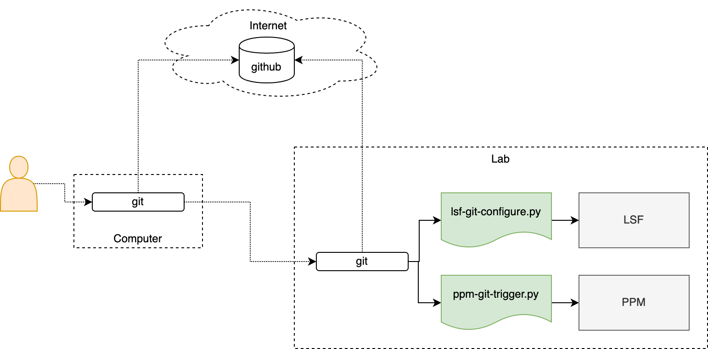
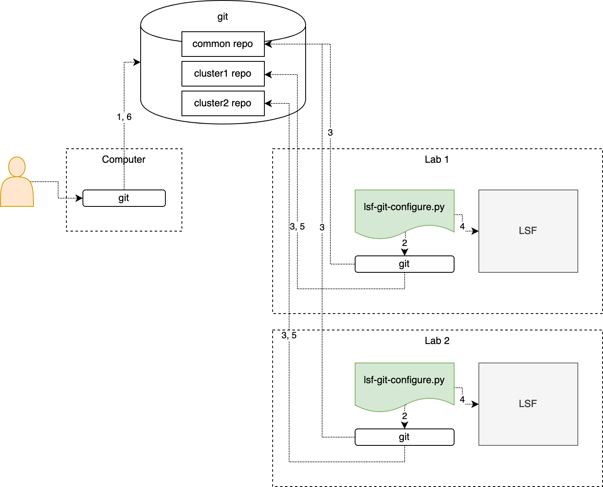
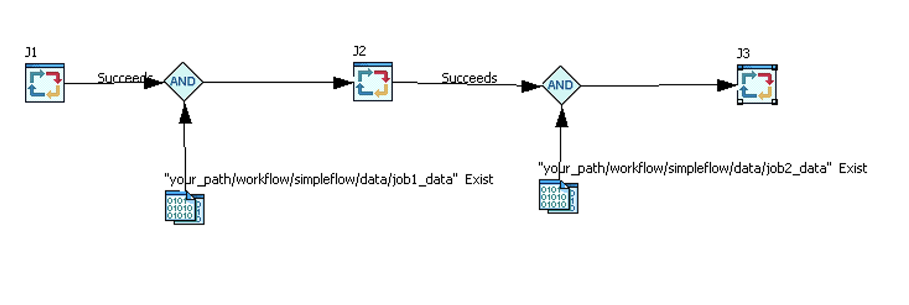

<!-- START doctoc generated TOC please keep comment here to allow auto update -->
<!-- DON'T EDIT THIS SECTION, INSTEAD RE-RUN doctoc TO UPDATE -->
**Table of Contents**  *generated with [DocToc](https://github.com/thlorenz/doctoc)*

- [LSF Git Operation](#lsf-git-operation)
  - [LSF Configuration Manager](#lsf-configuration-manager)
    - [Single Cluster Deployment](#single-cluster-deployment)
    - [Multi-cluster Deployment](#multi-cluster-deployment)
  - [PPM Workload Manager](#ppm-workload-manager)
    - [PPM Deployment](#ppm-deployment)

<!-- END doctoc generated TOC please keep comment here to allow auto update -->

# LSF Git Operation
LSF git operation script tools make git changes automatically trigger LSF opeartions.

Git operation scripts monitor git repo to apply file changes in local LSF and PPM.
<p align="center"></p>

LSF configurations and PPM workflows/data can be managed by git with advantages:
  - versioned data for LSF configurations, PPM workflow, etc.
  - attached history information as submission user account, commit message, etc.
  - access anywhere by git(hub)
  
**NOTE:** `git` and `python` should be installed to make script tools work.

## LSF Configuration Manager
The general steps to use LSF git operation are:
1. Manage your LSF configuration files in `git`
2. Run `lsf-git-configure.py`
3. Modify your LSF configuration files in local repository and `git push` your change

You can use `pre-receive` as git pre-receive hook. It is used to check a commit 
change to see if there is warning/error introduced in LSF. The commit will be rejected
if checking fails. This is not mandatory to use LSF git operation tool but perfered to
to have to make your LSF configuration as clean as possible.

Currently, we only support local checking. That means you need to make your git repo 
on LSF master host and set your cluster installation path into the `pre-receive` hook.
```bash
# clone or download this repo and edit pre-receive to define LSF path correctly
cp lsf-git-ops/src/lsf/pre-receive [your-git-repo]/.git/hooks/
```

### Single Cluster Deployment
Below is a step to step example.

- prepare git environment to manage LSF configuration
```bash
# create a working git repository environment as bare repo
cd /usr/local/work/lsfconf
git init --bare
git config receive.denyCurrentBranch ignore

# configure lsf configruation git repo and make it connect to the bare repo
cd $LSF_ENVDIR
git init
git add .
git commit -m 'manage lsf configuration in git'
git remote add upstream /usr/local/work/lsfconf
git push --set-upstream upstream master
```

- start up LSF git opeartion script for configuration on master host
```bash
# clone or download this repo and navigate to repo root directoy, then run below command
src/lsf/lsf-git-configure.py
```

- **manage LSF configuration in client**
```bash
git clone [git-host]:/usr/local/work/lsfconf
cd lsfconf/
vi lsf.conf # add LSB_ENABLE_HPC_ALLOCATION=N
git add .
git commit -m 'add parameter LSB_ENABLE_HPC_ALLOCATION=N'
git push
```

- check LSF configuration on master
```bash
# before manage LSF configuration in client
badmin showconf mbd | grep HPC # old display
# after manage LSF configuration in client
badmin showconf mbd | grep HPC # updated display
```

### Multi-cluster Deployment
For multi-cluster configuration management, it works as:

<p align="center"></p>

1. Modify and push cluster private and common repos from local
2. Periodically check new commits for private and common repos
3. Retrieve commits for private and common repos
4. Take corresponding LSF operations  
5. (optionally) Push the operation result to `git-configuration.log` for private repo
6. (optionally) Get the response from private repo

Below is a step to step example.
- prepare git environment to manage LSF configurations
```bash
# create working git repository environments as central repos.
#
# for cluster native configuration file, it has same preparation steps in single cluster case
# take LSF_CLUSTER_NAME=cluster1 as example, you can do below for all clusters individually
cd /usr/local/work/lsf-conf-cluster1
git init --bare
git config receive.denyCurrentBranch ignore

# for shared common configuration file
# make sure the common repo can be accessed from all clusters
cd /home/test/repo/common
git init --bare
git config receive.denyCurrentBranch ignore

# clone common repository for local cluster use
# take LSF_CLUSTER_NAME=cluster1 as example, you can do below for all clusters
cd  /tmp
git clone git-host:/home/test/repo/common
cd common
echo "# the file can be included by lsb.queues  " >>lsb.queues.common
git add .
git commit -m 'initialize an included configuration file'

cd $LSF_ENVDIR
# modify lsb.queues to add the common conf
echo "#INCLUDE \"/tmp/common/lsb.queues.common\" " >> lsbatch/cluster1/configdir/lsb.queues
git init
git add .
git commit -m 'manage lsf configuration in git'
git remote add upstream /usr/local/work/lsf-conf-cluster1
git push --set-upstream upstream master
```

- start up LSF configuration git opeartion script on the master of each cluster
```bash
# clone or download this repo and navigate to repo root directoy, then run below command
src/lsf/lsf-git-configure.py --shared_envdir=/tmp/common
```

- **manage LSF configuration in client**
```bash
git clone git-host:/home/test/repo/common
cd common
# add a new queue "common" for all clusters
cat << EOF > lsb.queues.common
Begin Queue
QUEUE_NAME   = common
PRIORITY     = 30
INTERACTIVE  = NO
FAIRSHARE    = USER_SHARES[[default,1]]
End Queue
EOF

git add .
git commit -m "update lsb.queues.common to add a new queue"
git push

```

- check LSF configuration on master
```bash
# take cluster1 as example, you can do below for all clusters 
[user@test ~]# lsid
IBM Spectrum LSF Standard 10.1.0.6, Oct 10 2019
Copyright International Business Machines Corp. 1992, 2016.
US Government Users Restricted Rights - Use, duplication or disclosure restricted by GSA ADP Schedule Contract with IBM Corp.

My cluster name is cluster1
My master name is test.ibm.com
[user@test ~]#
[user@test ~]#bqueues common
QUEUE_NAME      PRIO STATUS          MAX JL/U JL/P JL/H NJOBS  PEND   RUN  SUSP
common          30  Open:Active       -    -    -    -     0     0     0     0
[user@test ~]#
```

## PPM Workload Manager
The general steps to use PPM git operation are:
1. Manage your PPM flow definition and file dependences in `git`
2. Run `ppm-git-trigger.py`
3. Modify your flow definition file and the data in your local repository and `git push` the changes

The managed git repo should have below conventions for PPM git opeartion script:
 - root dir has `workflow` subdirectory.
 - `workflow` includes flow directory and `data`(optionally).
```
/workflow/
      flow-name-A/
         my-flow-A.xml
         data/
            A.data
            B.data
            C.data
            out/
               A.out
            status/
               error.msg
      flow-name-B/
      flow-name-C/
/others
```

### PPM Deployment
Workflow can be submitted when it is pushed to the git repository.
The workflow can also be designed to depend on the data to trigger the flow and continue the job.

Below is a step to step example.

Here just take `samples` in this repo as example, you also can create your flows on demand.

<p align="center"></p>

The `simpleflow` has three jobs:
1. J1(command is "sleep 1") will run automaticlly after flow triggered
2. J2(command is "sleep 2") will begin when all conditions are met(J1 is succeed and your_path/workflow/simpleflow/data/job1_data exist)
3. J3(command is "sleep 3") will begin when all conditions are met(J2 is succeed and your_path/workflow/simpleflow/data/job2_data exist)

- prepare git environment to manage LSF configuration
```bash
# create a working git repository environment as bare repo
cd /usr/local/work/ppmworkflow/
git init --bare
git config receive.denyCurrentBranch ignore

# configure PPM data git repository and make it connect to the bare repo
cd /tmp
# clone or download this repo to /tmp 
# copy samples directory in this repo to /tmp 
cp -rf lsf-git-ops/src/ppm/samples ./
cd samples
# need replace the your_path (as a placeholder in workflow/simpleflow/simpleflow.xml) with /tmp/samples
# also need replace the user (as a placeholder in workflow/simpleflow/simpleflow.xml) with your name
sed -i 's/your_path/\tmp\/samples/g' workflow/simpleflow/simpleflow.xml
sed -i 's/user/your/g' workflow/simpleflow/simpleflow.xml
git init
git add .
git commit -m 'manage ppm flows in git'
git remote add upstream /usr/local/work/ppmworkflow
git push --set-upstream upstream master
```

- start up LSF configuration git opeartion script
```bash
cd /tmp/lsf-git-ops/src/
# please make sure you have the permission to submit and trigger flows.
ppm/ppm-git-trigger.py -p /tmp/samples
# now the flow simpleflow in the /tmp/samples directory should be submitted and triggered
# J3 is under Waiting state due to not all the conditions are met
[user@test ~]# jflows 1
FLOW_ID: 1

USER             NAME
user             simpleflow

STATE     START TIME                         END TIME
Running   Thu Feb 27 23:20:48 GMT-05:00 2020

CURRENTLY-USED VERSION: 1.0

DETAILS:

NAME                                       TYPE         STATE     JOBID  JOBTYPE
1:user:simpleflow:J1                       Job          Done      2313
1:user:simpleflow:J2                       Job          Done      2314
1:user:simpleflow:J3                       Job          Waiting   0

[user@test ~]#
```

- **manage PPM workflow in client**
```bash
git clone git-host:/usr/local/work/ppmworkflow
cd ppmworkflow
touch workflow/simpleflow/job2_data
git commit -m 'add job2_data for job3' -a
git push
```

- check your PPM and LSF to see if workflow and job work as expected

```bash
[user@test ~]# jflows 1
FLOW_ID: 1

USER             NAME
user             simpleflow

STATE     START TIME                         END TIME
Done      Thu Feb 27 23:20:48 GMT-05:00 2020 Thu Feb 27 23:25:38 GMT-05:00 2020

CURRENTLY-USED VERSION: 1.0

DETAILS:

NAME                                       TYPE         STATE     JOBID  JOBTYPE
1:user:simpleflow:J1                       Job          Done      2313
1:user:simpleflow:J2                       Job          Done      2314
1:user:simpleflow:J3                       Job          Done      2315

```

